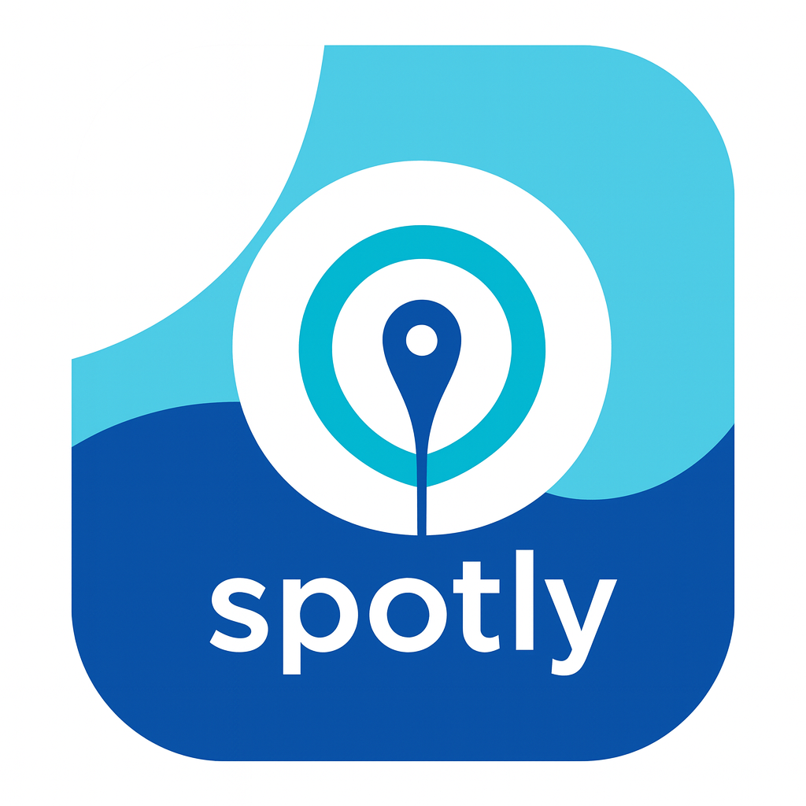
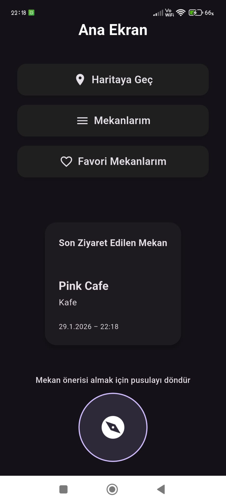
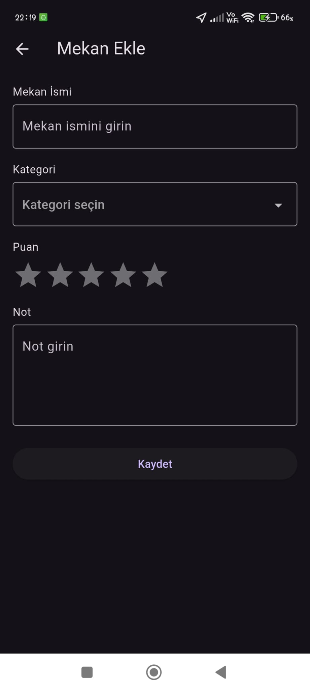
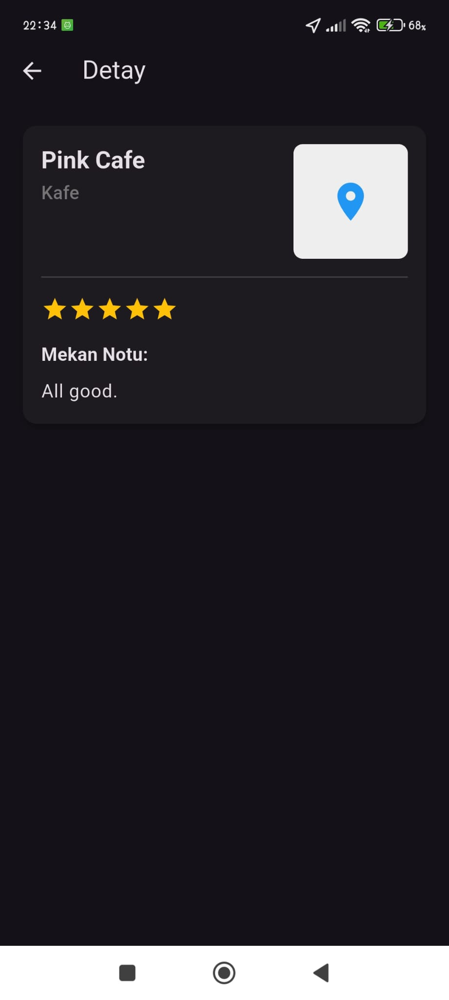

# 🗺️ Spotly

<div align="center">



[](https://github.com/ozdogrumerve/Spotly/stargazers)
[](https://github.com/ozdogrumerve/Spotly/network)
[](https://github.com/ozdogrumerve/Spotly/issues)
[](LICENSE) <!-- TODO: Add LICENSE file if not present -->

**Your personal location companion to add, categorize, and explore places on an interactive map.**

</div>

## 📖 Overview

Spotly is an intuitive location-based mobile application designed to help users effortlessly manage their personal places. Developed with Flutter, it leverages the power of Firebase for real-time data storage and robust user authentication, while integrating Google Maps for dynamic location visualization and seamless route navigation. Spotly offers a clean, user-friendly experience, making it simple to add, categorize, and revisit all your cherished spots.

## ✨ Features

-   🎯 **Interactive Map Interface**: Visualize all your saved places on a dynamic Google Map.
-   📍 **Add & Manage Places**: Easily add new locations with custom names, descriptions, and geographical coordinates.
-   🏷️ **Category Management**: Organize places into user-defined categories for better filtering and management.
-   🔍 **Place Details & Editing**: View comprehensive details for each saved spot and update information as needed.
-   🗺️ **Route Navigation**: Get directions to any saved location directly within the app using Google Maps.
-   ☁️ **Real-time Data Sync**: Securely store and synchronize your data across devices with Firebase Firestore.
-   🔐 **User Authentication**: Secure your personal places with Firebase Authentication (email/password, Google Sign-In, etc., if implemented).
-   🎨 **Responsive & Intuitive UI**: Enjoy a modern, user-friendly interface optimized for mobile devices.

## 🖥️ Screenshots

<table>
  <tr>
    <td align="center">
      <br/>
      <em>Quick access to saved spots, last visit summary, and suggestion compass.

</em>
    </td>
    <td align="center">
      <br/>
      <em>Easily add a new place with detailed information.</em>
    </td>
    <td align="center">
      <br/>
      <em>A detailed view of a selected place including its category, rating, and user note.</em>
    </td>
  </tr>
</table>


## 🛠️ Tech Stack

**Mobile Frontend:**
[](https://flutter.dev/)
[](https://dart.dev/)

**Backend Services:**
[](https://firebase.google.com/)

**Database:**
[](https://firebase.google.com/docs/firestore)

**Mapping & Location:**
[](https://cloud.google.com/maps-platform)

## 🚀 Quick Start

Follow these steps to get Spotly up and running on your local development environment.

### Prerequisites

Before you begin, ensure you have the following installed:

-   **Flutter SDK**: [Installation Guide](https://flutter.dev/docs/get-started/install)
    -   Verify installation: `flutter doctor`
-   **Dart SDK**: Included with Flutter.
-   **IDE**: [VS Code](https://code.visualstudio.com/) with Flutter extension or [Android Studio](https://developer.android.com/studio) with Flutter/Dart plugins.
-   **Emulator/Device**: An Android emulator, iOS simulator, or a physical device for running the app.

### Installation & Setup

1.  **Clone the repository**
    ```bash
    git clone https://github.com/ozdogrumerve/Spotly.git
    cd Spotly
    ```

2.  **Install dependencies**
    Navigate to the project root and fetch Flutter dependencies:
    ```bash
    flutter pub get
    ```

3.  **Firebase Project Setup**
    Spotly relies on Firebase for authentication and real-time data storage.
    -   Go to the [Firebase Console](https://console.firebase.google.com/) and create a new project.
    -   Add an Android app to your Firebase project:
        -   Register your app (use `com.example.spotly` or your chosen package name from `android/app/src/main/AndroidManifest.xml`).
        -   Download the `google-services.json` file.
        -   Place `google-services.json` into the `android/app/` directory.
    -   Add an iOS app to your Firebase project:
        -   Register your app (use `com.example.spotly` or your chosen bundle ID from `ios/Runner.xcodeproj/project.pbxproj`).
        -   Download the `GoogleService-Info.plist` file.
        -   Open your iOS project in Xcode (`ios/Runner.xcworkspace`), right-click on `Runner`, and select "Add Files to 'Runner'..." to add `GoogleService-Info.plist` to your app.
    -   Enable **Cloud Firestore** and **Authentication** (e.g., Email/Password, Google Sign-In) in your Firebase project settings.

4.  **Google Maps API Key Setup**
    Spotly uses Google Maps for displaying locations.
    -   Go to the [Google Cloud Console](https://console.cloud.google.com/) and enable the following APIs for your project:
        -   Maps SDK for Android
        -   Maps SDK for iOS
        -   Places API (if place search is implemented)
        -   Geolocation API (if current location detection is needed)
    -   Create an API key with appropriate restrictions.
    -   **For Android**:
        -   Open `android/app/src/main/AndroidManifest.xml`.
        -   Add your API key within the `<application>` tag, replacing `YOUR_GOOGLE_MAPS_API_KEY`:
            ```xml
            <meta-data
                android:name="com.google.android.geo.API_KEY"
                android:value="YOUR_GOOGLE_MAPS_API_KEY"/>
            ```
    -   **For iOS**:
        -   Open `ios/Runner/AppDelegate.swift` (or `AppDelegate.m` for Objective-C).
        -   Add the following to `application:didFinishLaunchingWithOptions:` replacing `YOUR_GOOGLE_MAPS_API_KEY`:
            ```swift
            import GoogleMaps
            GMSServices.provideAPIKey("YOUR_GOOGLE_MAPS_API_KEY")
            ```
            (For Objective-C)
            ```objective-c
            #import <GoogleMaps/GoogleMaps.h>
            [GMSServices provideAPIKey:@"YOUR_GOOGLE_MAPS_API_KEY"];
            ```

5.  **Start the development server**
    Run the application on your connected device or emulator:
    ```bash
    flutter run
    ```
    The app will automatically launch on the selected device.

## 📁 Project Structure

```
Spotly/
├── .github/             # GitHub Actions workflows (if any)
├── android/             # Android native project files
├── assets/              # Static assets (images, fonts, etc.)
├── ios/                 # iOS native project files
├── lib/                 # Dart source code for the Flutter application
│   ├── main.dart        # Main entry point of the application
│   ├── models/          # Data models (e.g., Place, Category, User)
│   ├── services/        # Abstractions for Firebase (Firestore, Auth) and location services
│   ├── providers/       # State management providers (if using Provider, Riverpod, etc.)
│   ├── screens/         # UI for different application pages/screens
│   ├── widgets/         # Reusable UI components
│   └── utils/           # Utility functions and helpers
├── linux/               # Linux desktop project files
├── macos/               # macOS desktop project files
├── web/                 # Web project files (if Flutter web is targeted)
├── windows/             # Windows desktop project files
├── test/                # Unit and widget tests
├── pubspec.yaml         # Project dependencies and metadata
├── pubspec.lock         # Specific versions of dependencies
├── analysis_options.yaml# Dart linter rules
└── README.md            # Project README file
```

## ⚙️ Configuration

### Environment Variables
While Firebase configuration files (`google-services.json`, `GoogleService-Info.plist`) handle most backend settings, API keys like Google Maps API Key are typically managed as build-time configurations in platform-specific files. For more complex environment management, consider using `flutter_dotenv` package or similar.

| Variable | Description | Example Location |
|----------|-------------|------------------|
| `GOOGLE_MAPS_API_KEY` | Your Google Maps Platform API Key. | `android/app/src/main/AndroidManifest.xml`, `ios/Runner/AppDelegate.swift` |

### Firebase Rules
Ensure your Firebase Firestore and Storage security rules are configured to allow appropriate read/write access for authenticated users.

## 🔧 Development

### Available Flutter Commands

| Command           | Description                                       |
|-------------------|---------------------------------------------------|
| `flutter run`     | Runs the app on a connected device/emulator.      |
| `flutter build`   | Builds the app for a specific platform.           |
| `flutter test`    | Runs all tests in the `test/` directory.          |
| `flutter analyze` | Analyzes the project for potential issues.        |
| `flutter format .`| Formats Dart code according to best practices.    |
| `flutter clean`   | Deletes the build/cache directories.              |
| `flutter doctor`  | Shows information about the installed toolchains. |

### Development Workflow
1.  Make code changes in the `lib/` directory.
2.  Use `flutter run` to deploy and see changes on your device/emulator. Hot reload (press `r` in the terminal) or hot restart (press `R`) to quickly update the UI.
3.  Run `flutter analyze` regularly to catch any code quality issues.
4.  Write tests in the `test/` directory to ensure functionality.

## 🧪 Testing

Spotly uses Flutter's built-in testing framework for unit and widget tests.

```bash
# Run all tests
flutter test

# Run tests with coverage report (requires lcov)
flutter test --coverage

# Run a specific test file
flutter test test/widgets/my_widget_test.dart
```

## 🚀 Deployment

To prepare Spotly for release to app stores, you'll need to build a release version.

### Production Build

```bash
# Build an Android App Bundle (AAB) for Google Play Store
flutter build appbundle

# Build an Android APK
flutter build apk

# Build an iOS app for App Store Connect (requires macOS and Xcode)
flutter build ipa
```

### Deployment Steps (General)
1.  **Configure Signing**: Set up app signing for Android and iOS. Refer to the [Flutter documentation for Android signing](https://flutter.dev/docs/deployment/android#sign-the-app) and [iOS signing](https://flutter.dev/docs/deployment/ios#signing-your-app).
2.  **Firebase Release**: Ensure your Firebase project is properly configured for production use (e.g., correct API key restrictions, production database rules).
3.  **App Store Submission**:
    -   For Android: Upload the generated `.aab` file to the [Google Play Console](https://play.google.com/console).
    -   For iOS: Upload the generated `.ipa` file to [App Store Connect](https://appstoreconnect.apple.com/) via Xcode or `flutter build ipa`.

## 🤝 Contributing

We welcome contributions to Spotly! If you're interested in improving the app, please consider:

1.  Forking the repository.
2.  Creating a new branch (`git checkout -b feature/AmazingFeature`).
3.  Making your changes.
4.  Ensuring your code adheres to the project's style and passes tests.
5.  Committing your changes (`git commit -m 'Add some AmazingFeature'`).
6.  Pushing to the branch (`git push origin feature/AmazingFeature`).
7.  Opening a Pull Request.

Please see our [Contributing Guide](CONTRIBUTING.md) for more detailed instructions.

## 🙏 Acknowledgments

-   [Flutter](https://flutter.dev/) for the amazing mobile development framework.
-   [Firebase](https://firebase.google.com/) for powerful backend services.
-   [Google Maps Platform](https://cloud.google.com/maps-platform) for interactive mapping solutions.
-   The Flutter community for countless resources and support.

## 📞 Support & Contact

-   📧 Email: [ozdogrumerve57@gmail.com] 
-   🐛 Issues: Feel free to report bugs or suggest features on [GitHub Issues](https://github.com/ozdogrumerve/Spotly/issues)
-   👤 Author: [Merve Özdoğru](https://github.com/ozdogrumerve)

---

<div align="center">

**⭐ Star this repo if you find it helpful!**

Made with ❤️ by [Merve Özdoğru](https://github.com/ozdogrumerve)

</div>
